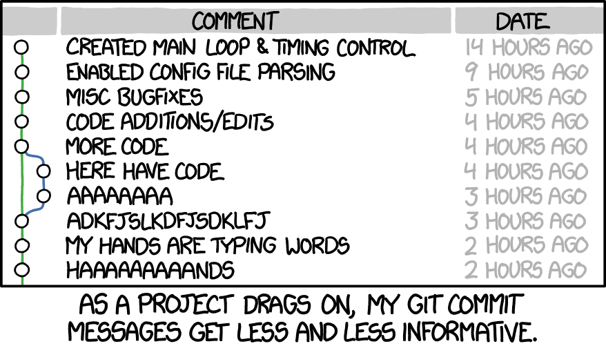

Bad commit messages
---

> A diff tells you **what** changed. Only the commit message can tell you **why**.



<!-- end_slide -->

Better commit messages
---

From [How to Write a Git Commit Message](https://cbea.ms/git-commit/) — the seven rules:

<!-- incremental_lists: true -->
1. Separate subject from body with a blank line
2. Limit the subject line to **50 characters**
3. Capitalise the subject line
4. Do not end the subject line with a period
5. Use the **imperative mood** — _"Fix bug"_, not _"Fixed bug"_
6. Wrap the body at **72 characters**
7. Use the body to explain **what and why**, not how

## Bad

```bash
$ git log --oneline

a3f9c12 fix
b1dc004 wip
cc831da PLEASE WORK
f00ba44 trying again
9d3e021 Did so many stuff I cannot t even write a proper commit message that would explain it all in one sentece that could fit anywhere
```

<!-- pause -->

## Good

```bash
$ git log --oneline

a3f9c12 Fix authentication bug
b1dc004 Add new feature to the API
e7a2190 Update documentation for the new API endpoint
cc831da Refactor authentication module for better perf
```

<!-- end_slide -->

Conventional Commits
---

A lightweight convention on top of commit messages
[conventionalcommits.org](https://www.conventionalcommits.org)

<!-- pause -->

## Anatomy

```text {1-7|9|11|all}
<type>[optional scope]: <description>
  │       │               │
  │       │               └─> Summary in present tense. Not capitalized. No period at the end
  │       │
  │       └─> Commit Scope 
  │
  └─> Commit Type: feat, fix, test, chore, ci, build, docs, perf, refactor, style, revert, etc.

[optional body]

[optional footer(s)]
```

<!-- pause -->

## Example

```text
feat(auth): add OAuth2 login with GitHub

Users can now sign in using their GitHub account via OAuth2.
The access token is stored in an encrypted cookie.

Closes #142
```

<!-- end_slide -->

The Building Blocks
---

| Part          | Required | Example                           |
| ------------- | -------- | --------------------------------- |
| `type`        | ✅       | `feat`, `fix`, `docs`, etc.       |
| `scope`       | ❌       | `(auth)`, `(api)`, `(ui)`         |
| `!`           | ❌       | marks a breaking change           |
| `description` | ✅       | short imperative summary          |
| `body`        | ❌       | explains the _why_                |
| `footer`      | ❌       | `Closes #42`, `BREAKING CHANGE:`  |

<!-- end_slide -->

Types
---

Types are the most important part of a Conventional Commit message. They communicate the **intent** of the change, not just the action.
Mostly used are types from [`@commitlint/config-conventional`](https://github.com/conventional-changelog/commitlint/tree/master/%40commitlint/config-conventional), which are based on the [Angular convention](https://github.com/angular/angular/blob/main/CONTRIBUTING.md#cibcommit).

<!-- incremental_lists: true -->
- `feat`: A new feature
- `fix`: A bug fix
- `test`: Adding missing tests or correcting existing tests
- `docs`: Documentation only changes
- `ci`: Changes to CI configuration files and scripts (example scopes: Travis, Circle, BrowserStack, SauceLabs)
- `build`: Changes that affect the build system or external dependencies (example scopes: gulp, broccoli, npm)
- `perf`: A code change that improves performance
- `refactor`: A code change that neither fixes a bug nor adds a feature
- `style`: Changes that do not affect the meaning of the code (white-space, formatting, missing semi-colons, etc)
- `chore`: Other changes that don't modify src or test files
- `revert`: Reverts a previous commit

<!-- end_slide -->

Breaking changes
---

## A ! before description

Breaking changes can be marked by adding an exclamation mark after the type/scope:

```text
feat!: drop Node 16 support
```

<!-- pause -->

## Footer

Alternatively, you can use the footer to describe a breaking change:

```text
feat(api): redesign pagination

BREAKING CHANGE: cursor replaces page/limit query params
```

<!-- pause -->

## Both

You can also use both the `!` and the footer to mark a breaking change:

```text
feat!: redesign pagination

BREAKING CHANGE: cursor replaces page/limit query params
```

<!-- end_slide -->

Why Bother?
---

<!-- incremental_lists: true -->
- 🧠 **Readable history** — even six months later, the intent is clear
- 🔍 **Scoped context** — `fix(payments):` tells you _where_ before you read further
- 🤝 **Team consistency** — no more guessing each contributor's style
- 🤖 **Machine-readable** — tools can parse, validate, and act on your commits
- 🏷️ **Semantic versioning signal** — `feat` → minor bump, `fix` → patch, `BREAKING CHANGE` → major

<!-- end_slide -->

Validate with Git Hooks
---

Block bad commits _before_ they land in the repo.

**`commit-msg` hook** — runs after the user writes the message:

```bash
#!/usr/bin/env sh
# .git/hooks/commit-msg

pattern='^(feat|fix|docs|style|refactor|test|chore)(\(.+\))?(!)?: .{1,72}'

if ! grep -qE "$pattern" "$1"; then
  echo "❌ Commit message does not follow Conventional Commits."
  echo "   Example: feat(auth): add GitHub OAuth login"
  exit 1
fi
```

<!-- pause -->

Or use **commitlint** for a battle-tested solution:

```bash
npm install --save-dev @commitlint/cli @commitlint/config-conventional
echo "export default { extends: ['@commitlint/config-conventional'] };" \
  > commitlint.config.mjs
```

Then wire it up with **Husky** or **lefthook**.

<!-- end_slide -->

Commitizen CLI and `git cz`
---

[commitizen.github.io](https://commitizen.github.io/cz-cli/) — an interactive CLI for crafting Conventional Commits.

<!--pause -->

Install:

```bash
# Global CLI install
npm install -g commitizen

# Project CZ adapter
npm install --save-dev cz-conventional-changelog
```

<!-- pause -->

Configure your project:

```json
// .czrc
{
  "path": "./node_modules/cz-conventional-changelog",
  "exclamationMark": true,
  "skipScope": false,
  "customScope": true,
  "scopes": [
    "infra",
    "core",
    "tadaima",
    "waifu"
  ]
}
```

Use:

```bash
git add .
git cz
```

<!-- end_slide -->

Changelog Generation with `git cliff`
---

[git-cliff.org](https://git-cliff.org) — a highly configurable changelog generator written in Rust.

```bash
cargo install git-cliff
# or: brew install git-cliff
```

<!-- pause -->

```bash
# Generate CHANGELOG.md from all commits
git cliff --output CHANGELOG.md

# Only since the last tag
git cliff --latest --output CHANGELOG.md

# Preview without writing
git cliff --unreleased

# Bump version based on commits since last tag
git cliff --bump
```

<!-- end_slide -->

Release Automation with `release-please`
---

[github.com/googleapis/release-please](https://github.com/googleapis/release-please) — Google's release automation bot.

<!-- pause -->

**How it works:**

1. You push commits following Conventional Commits
2. `release-please` opens a **Release PR** that:
   - bumps `version` in your manifest
   - generates / updates `CHANGELOG.md`
3. You **merge the PR** → it tags and creates a GitHub Release automatically

<!-- pause -->

**GitHub Actions setup:**

```yaml
# .github/workflows/release-please.yml
on:
  push:
    branches: [main]

jobs:
  release-please:
    runs-on: ubuntu-latest
    steps:
      - uses: googleapis/release-please-action@v4
        with:
          release-type: node  # or: rust, python, go, simple…
```

<!-- pause -->

> `feat` → minor bump · `fix` → patch · `BREAKING CHANGE` → major

<!-- end_slide -->

Summary
---

<!-- incremental_lists: true -->

- A well-formed commit message communicates **intent**, not just action
- Conventional Commits add a **machine-readable structure** on top of good habits
- `type(scope): description` is all you need to get started
- Git hooks keep the team **honest** without extra effort
- `git cliff` and `release-please` turn your history into **automated releases**
- `commitizen` removes the cognitive load of remembering the format
  
<!-- end_slide -->

<!-- jump_to_middle -->

Questions?
---

<!-- end_slide -->

Thank You
---

```text
feat(you): attend this talk and never write "fix stuff" again
```


