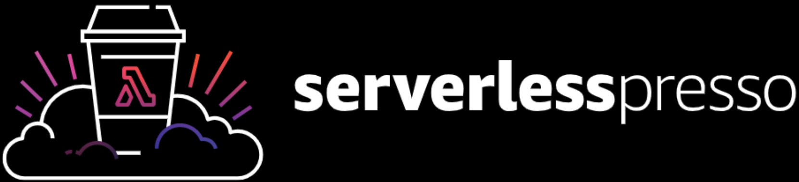
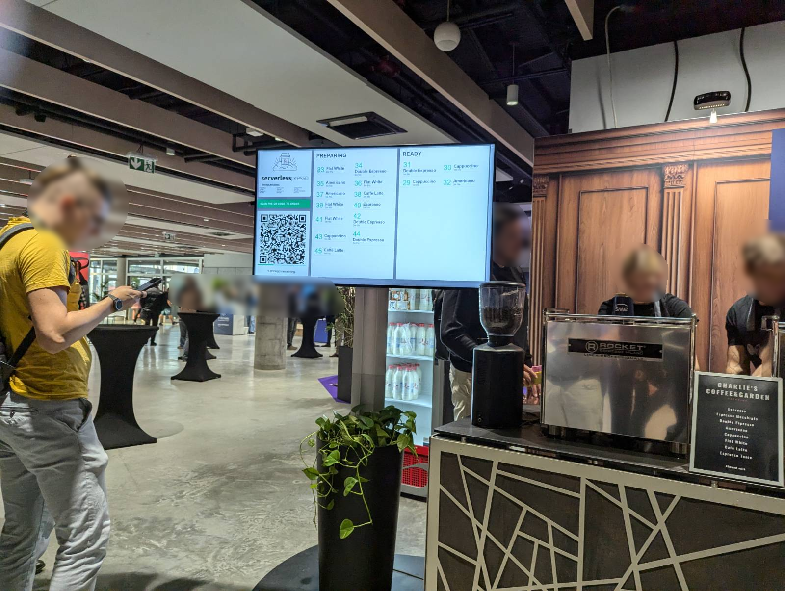
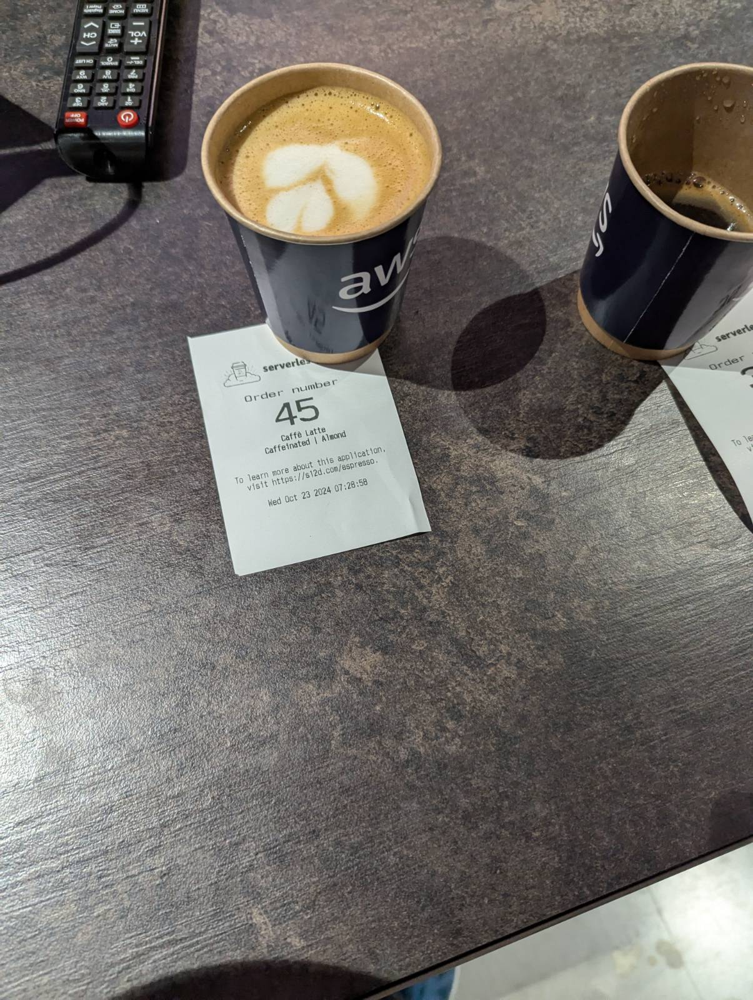
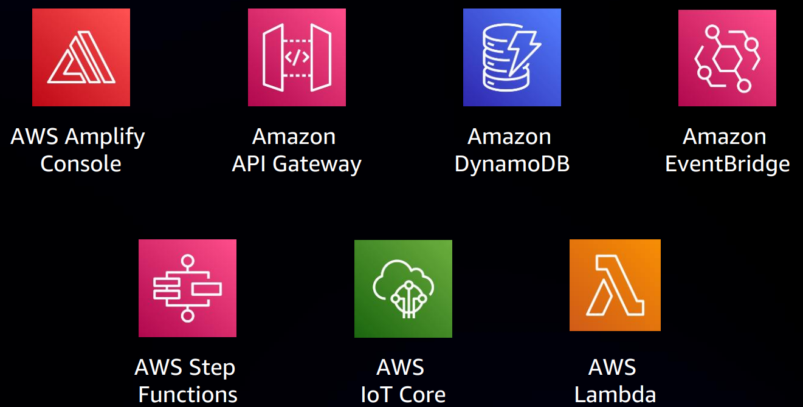
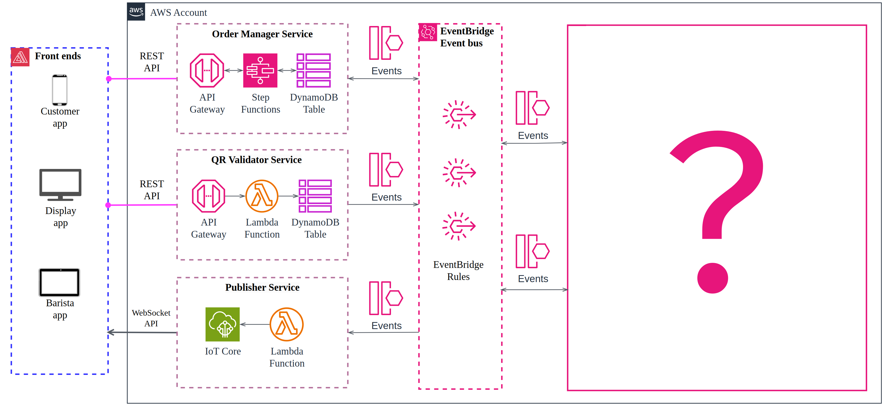
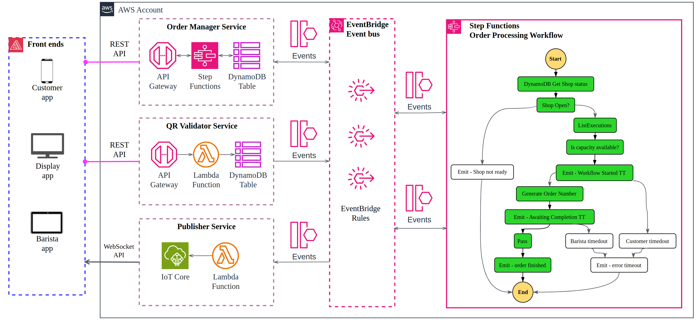
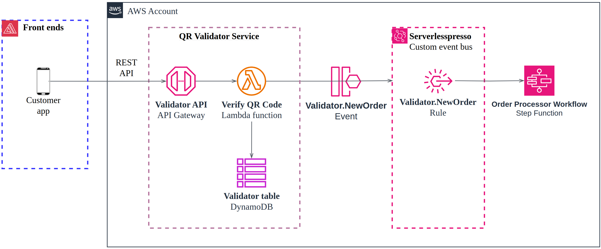
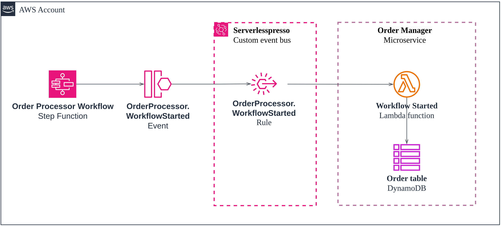
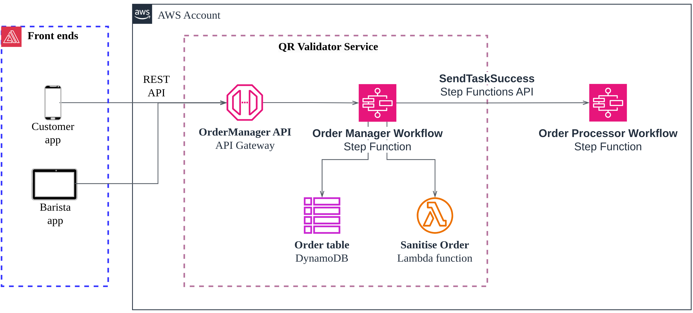
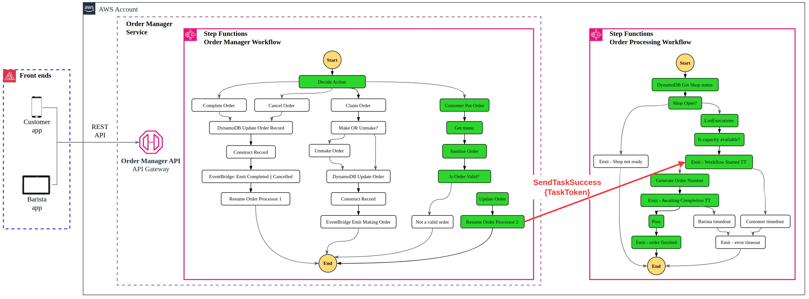

#

Architecture overview of state of the art serverless, event-driven application to get you a delicious cup of coffee on AWS events.

---

## What it is?

`-`

- Serverlesspresso is a serverless, event-driven coffee ordering system
- originally introduced at AWS re:Invent 2021 and reused on other AWS events
- serves as a reference application on how to build serverless, event-driven, scalable, cost-efficient, and highly responsive applications

---

## How it works?

`-`

## Has three frontends

- **Display app** - provides a barcode for customers to scan to place an order, and shows a realtime queue of upcoming and completed drink orders
- **Barista app** - allows baristas to view orders and manage drink preparation
- **Ordering app** - enables customers to place and customize their coffee orders

`-`

## Has several backend microservices

- **Order manager service** - manages the order lifecycle
- **QR validator service** - validates QR codes and starts the order process
- **Publisher service** - publishes order events to IoT Core topics for frontend real-time updates

`-`

### Order flow

1. **Display app** displays a time and orders limited QR code
1. Customers scan this QR code to place an order using their mobile device
1. Customers place the order on the web **Ordering app**
1. The baristas see the order appear on the **Barista app**
1. Order updates are shown in real-time on the **Display app** and **Customer app**

`-`

`-`

`-`

### Demo time!?

---

## How it is built?

`-`

### Used AWS services

`-`

### Overall architecture?

`-`

### Overall architecture

`-`

### New order processing

`-`

### Workflow start

`-`

### Order manager workflow

`-`

`-`

### Let's dive to the step functions

---

## What it costs?

`-`

Following costs is for 1000 orders per day:

`-`

| Service             | Daily cost | AWS Free Tier |
| :------------------ | :--------: | :-----------: |
| AWS Amplify Console |   $0.28    |     Free      |
| Amazon API Gateway  |   $0.01    |     Free      |
| Amazon Cognito      |    Free    |     Free      |
| Amazon DynamoDB     |   $0.01    |     Free      |
| Amazon EventBridge  |   $0.01    |     Free      |
| AWS IoT Core        |   $0.01    |     Free      |
| AWS Lambda          |   $0.01    |     Free      |
| AWS Step Functions  |   $0.29    |     Free      |
| **Total**           | **$0.62**  |   **Free**    |

---

## ? Questions ?

---

## Resources

- [Slides](https://github.com/Malanius/talks/tree/main/serverlesspresso)
- [Serverlesspresso event catalog](https://serverlesscoffee.com/)
- [Serverlesspresso Workshop](https://catalog.workshops.aws/serverlesspresso/)
- made with [reveal.js](https://revealjs.com/)

